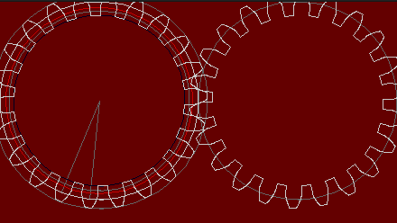
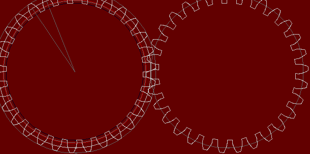

# involute-gears

## References

Implemented using instructions from this site:
https://www.tec-science.com/mechanical-power-transmission/involute-gear/meshing-line-action-contact-pitch-circle-law/

Other reference
https://khkgears.net/new/gear_knowledge/abcs_of_gears-b/basic_gear_terminology_calculation.html

These videos was what finally explained it 
https://www.youtube.com/watch?v=3ixCxjDkmV0

https://www.youtube.com/watch?v=nrsCoQN6V4M

